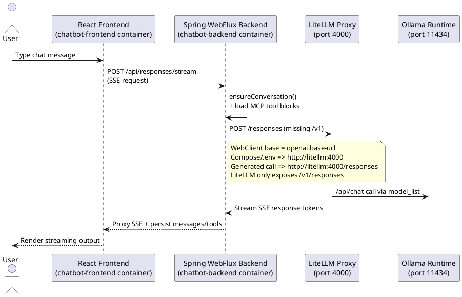
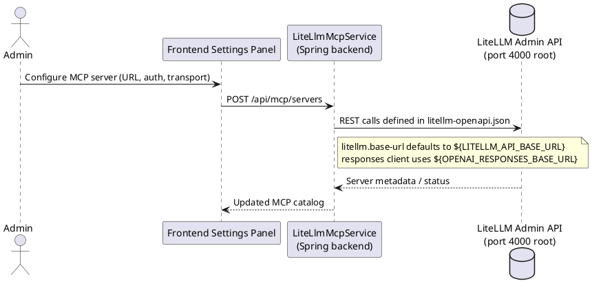

# Frontend ⇔ Backend ⇔ LiteLLM Communication Report

This note captures how chat traffic flows across the Docker Compose stack and highlights the current communication bugs that break `/v1/responses` usage while MCP servers are injected through LiteLLM's OpenAPI contract.

## Streaming Flow (PlantUML)

## MCP Registration Flow (PlantUML)

## Compose-Level Observations

- `docker-compose.yml` now sets two base URLs: `OPENAI_RESPONSES_BASE_URL` (must include `/v1`) and `LITELLM_API_BASE_URL` (root host, no `/v1`).
- `ResponsesClientConfig` builds its WebClient with `openai.base-url` and then calls `.uri("/responses")`, so the emitted request path is `${OPENAI_RESPONSES_BASE_URL}/responses` → `/v1/responses`.
- `litellm.base-url` is scoped to `LITELLM_API_BASE_URL`, keeping MCP admin calls on the root path.
- The frontend is isolated from LiteLLM and only talks to `chatbot-backend`, so all Response API quirks surface exclusively inside the backend service.

## Identified Issues & Fix Strategy

1. **Responses API must land on `/v1/responses`.**  
   - Evidence (original): `openai.base-url` lacked `/v1`, so `webClient.post().uri("/responses")` hit `/responses` and failed.  
   - Fix path: defaults now resolve to `OPENAI_RESPONSES_BASE_URL` (with `/v1`), so `/responses` expands correctly. Keep a regression test that mocks LiteLLM and asserts the target path.

2. **Separate base URLs for streaming vs. admin.**  
   - Evidence (original): a single env value fed both streaming and admin, so adding `/v1` broke MCP admin.  
   - Fix path: split envs (`OPENAI_RESPONSES_BASE_URL`, `LITELLM_API_BASE_URL`) and document expected shapes. A startup health check should probe both base URLs separately.

3. **Lack of automated coverage for the LiteLLM bridge.**  
   - No integration/state tests assert that the backend can reach `/v1/responses` or that MCP provisioning works after env tweaking, so regressions like the current base-path mismatch slip into prod.  
   - Fix path: add a lightweight Spring @WebFluxTest that stubs LiteLLM with WireMock, asserts that SSE subscriptions happen against `/v1/responses`, and add a contract test for `LiteLlmMcpService` verifying it does **not** append `/v1`. Guard with CI.

Together, these steps ensure conversations stay in the backend while LiteLLM continues to provide both `/v1/responses` and the MCP admin API defined by the bundled OpenAPI specification.
