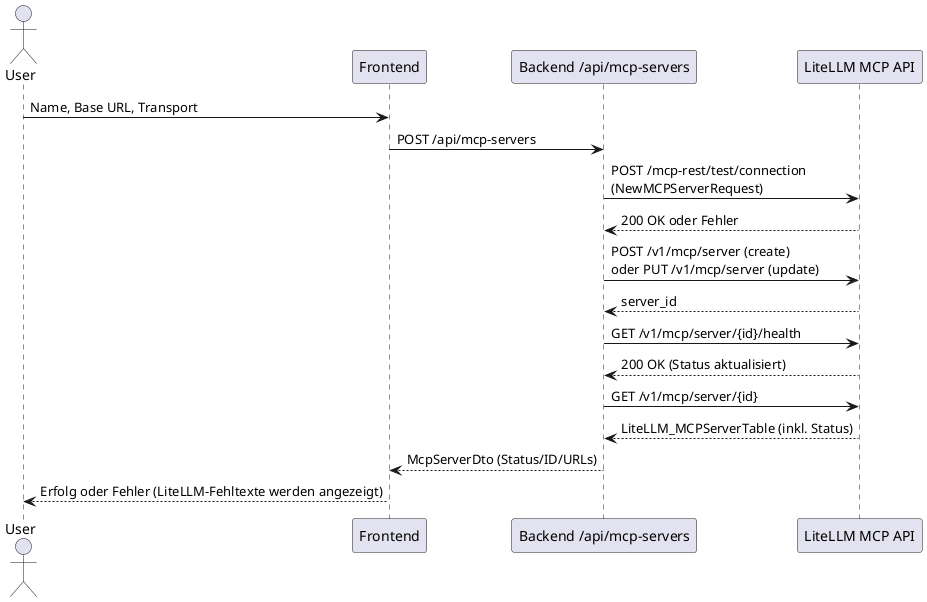

# Frontend-Backend Communication

## Overview

This document describes the communication patterns between the React frontend and Spring Boot backend, including REST API, Server-Sent Events (SSE), and state synchronization.

### Runtime base URLs
- Responses API: `OPENAI_RESPONSES_BASE_URL` (must include `/v1`, defaults to `http://litellm:4000/v1` inside Docker).
- LiteLLM admin/MCP API: `LITELLM_API_BASE_URL` (root host, defaults to `http://litellm:4000`).
- Frontend ↔ Backend: `VITE_API_BASE_URL` → `http://localhost:8080` (host) mapped to `chatbot-backend` container.
- Gradle `composeUp` wires these through `.env` so each container addresses the others by service name.

## Communication Architecture


## REST API Endpoints

### Conversation Management

#### List Conversations
```
GET /api/conversations
```

**Response**:
```json
[
  {
    "id": 1,
    "title": "Weather Chat",
    "status": "COMPLETED",
    "createdAt": "2025-11-06T10:00:00Z",
    "updatedAt": "2025-11-06T10:05:00Z"
  }
]
```

**Frontend Usage**:
```typescript
const conversations = await apiClient.get<Conversation[]>('/api/conversations');
```

#### Get Conversation
```
GET /api/conversations/{id}
```

**Response**:
```json
{
  "id": 1,
  "title": "Weather Chat",
  "status": "COMPLETED",
  "messages": [
    {
      "id": 1,
      "role": "USER",
      "content": "What's the weather?",
      "createdAt": "2025-11-06T10:00:00Z"
    },
    {
      "id": 2,
      "role": "ASSISTANT",
      "content": "It's sunny, 20°C",
      "createdAt": "2025-11-06T10:00:05Z"
    }
  ],
  "toolCalls": []
}
```

#### Create Conversation
```
POST /api/conversations
Content-Type: application/json

{
  "title": "New Chat"
}
```

#### Delete Conversation
```
DELETE /api/conversations/{id}
```

### MCP Server Management

#### Connector hinzufügen (mit Verbindungstest und Healthcheck)



**Base-URL beachten:** Im Docker-Netz muss der Hostname des MCP-Servers erreichbar sein (z. B. `http://n8n:5678/...` statt `http://localhost:5678/...`). LiteLLM prüft die Erreichbarkeit während `test/connection`; falsche Hosts werden sofort mit Fehler abgelehnt.

**Create/Update Request**:
```json
POST /api/mcp-servers
{
  "name": "n8n",
  "baseUrl": "http://n8n:5678/mcp/<workflow-id>",
  "transport": "sse",
  "requireApproval": "never"
}
```

**Tools laden** (Backend ruft LiteLLM `/mcp-rest/tools/list?server_id=...`):
```
GET /api/mcp/servers/{serverId}/capabilities
```
Fehler von LiteLLM (z. B. keine Verbindung) werden an die UI weitergereicht.

**Health manuell prüfen**:
```
GET http://litellm:4000/v1/mcp/server/{serverId}/health
Authorization: Bearer <LITELLM_ADMIN_TOKEN>
```

**Kurzformel (LaTeX) für eine erreichbare URL im Docker-Netz**:
```latex
\text{reachable\_url} = \text{scheme}://\text{service-name}:\text{port}/\text{path}
```
Beispiel: `http://n8n:5678/mcp/<id>`

## End-to-end verification
- Compose bootstrap: `./gradlew composeUp` (uses `.env` to set the base URLs above).
- UI + streaming check: Cucumber/Selenium feature at `chatbot-backend/src/test/resources/features/end_to_end.feature` exercised by `./gradlew :chatbot-backend:test --tests app.chatbot.e2e.CucumberE2ETest`.
- MCP registration check: same feature posts to `/api/mcp-servers` and asserts LiteLLM catalogs the server.

### Streaming Chat

#### Stream Chat Response (SSE)
```
POST /api/responses/stream
Content-Type: application/json
Accept: text/event-stream

{
  "conversationId": 1,
  "payload": {
    "model": "gpt-4",
    "messages": [
      {"role": "user", "content": "Hello"}
    ]
  }
}
```

**Events**: See [OpenAI Responses API](./OPENAI_RESPONSES_API.md) for full event list.

#### Tool Approval
```
POST /api/responses/approval/{approvalRequestId}
Content-Type: application/json

{
  "approved": true
}
```

### Tool Approval Policies

#### Get Approval Policies
```
GET /api/mcp/approval-policies?serverId={serverId}
```

#### Update Approval Policy
```
PUT /api/mcp/approval-policies
Content-Type: application/json

{
  "serverId": "n8n-server-1",
  "toolName": "dangerous_tool",
  "policy": "ALWAYS_DENY"
}
```

## Server-Sent Events (SSE)

### Chat Streaming Flow


### SSE Implementation

**Frontend (React)**:
```typescript
import { fetchEventSource } from '@microsoft/fetch-event-source';

const streamChatResponse = async (
  conversationId: number,
  message: string
) => {
  await fetchEventSource('/api/responses/stream', {
    method: 'POST',
    headers: {
      'Content-Type': 'application/json'
    },
    body: JSON.stringify({
      conversationId,
      payload: {
        model: 'gpt-4',
        messages: [{ role: 'user', content: message }]
      }
    }),
    onmessage(event) {
      const data = JSON.parse(event.data);
      handleStreamEvent(data);
    },
    onerror(err) {
      console.error('SSE error:', err);
      throw err;
    }
  });
};
```

**Backend (Spring Boot)**:
```java
@PostMapping(value = "/stream", produces = MediaType.TEXT_EVENT_STREAM_VALUE)
public Flux<ServerSentEvent<String>> streamResponses(
    @RequestBody ResponseStreamRequest request,
    @RequestHeader("Authorization") String authHeader
) {
    return responseStreamService.streamResponses(request, authHeader)
        .doOnError(ex -> log.error("Stream error", ex))
        .onErrorResume(ex -> 
            Flux.just(ServerSentEvent.builder("error")
                .data("{\"error\":\"" + ex.getMessage() + "\"}")
                .build())
        );
}
```

### Event Types

See detailed event types in [OpenAI Responses API](./OPENAI_RESPONSES_API.md).

**Common Events**:
- `response.created` - Stream initialized
- `response.text.delta` - Text chunk received
- `approval_required` - Tool approval needed
- `response.completed` - Stream finished
- `response.failed` - Error occurred

## State Management

### Frontend State (Zustand)

```plantuml
@startuml
!theme plain

package "Zustand Stores" {
  component "chatStore" as CHAT {
    + conversations: Conversation[]
    + currentConversation: Conversation | null
    + isStreaming: boolean
    + streamingMessage: string
    --
    + loadConversations()
    + loadConversation(id)
    + sendMessage(content)
    + approveToolExecution(id)
  }
  
  component "mcpServerStore" as MCP {
    + servers: McpServer[]
    + selectedServer: McpServer | null
    + capabilities: McpCapabilities | null
    --
    + loadServers()
    + createServer(data)
    + loadCapabilities(serverId)
    + syncCapabilities(serverId)
  }
  
  component "n8nStore" as N8N {
    + workflows: Workflow[]
    + status: ConnectionStatus
    --
    + loadWorkflows()
    + executeWorkflow(id)
  }
}

@enduml
```

### State Synchronization Flow


### Example: Send Message Flow

```typescript
// chatStore.ts
const chatStore = create<ChatStore>((set, get) => ({
  sendMessage: async (content: string) => {
    const { currentConversation } = get();
    if (!currentConversation) return;

    // Optimistic update
    set({ isStreaming: true, streamingMessage: '' });

    try {
      await fetchEventSource('/api/responses/stream', {
        method: 'POST',
        body: JSON.stringify({
          conversationId: currentConversation.id,
          payload: {
            model: 'gpt-4',
            messages: [{ role: 'user', content }]
          }
        }),
        onmessage: (event) => {
          const data = JSON.parse(event.data);
          
          if (data.type === 'response.text.delta') {
            set(state => ({
              streamingMessage: state.streamingMessage + data.delta
            }));
          }
          
          if (data.type === 'response.completed') {
            // Save message to conversation
            set(state => ({
              isStreaming: false,
              currentConversation: {
                ...state.currentConversation,
                messages: [
                  ...state.currentConversation.messages,
                  {
                    role: 'ASSISTANT',
                    content: state.streamingMessage
                  }
                ]
              }
            }));
          }
        }
      });
    } catch (error) {
      set({ isStreaming: false, error: error.message });
    }
  }
}));
```

## API Client Implementation

### TypeScript API Client

```typescript
// apiClient.ts
class ApiClient {
  private baseUrl: string;

  constructor(baseUrl: string = '/api') {
    this.baseUrl = baseUrl;
  }

  async get<T>(path: string): Promise<T> {
    const response = await fetch(`${this.baseUrl}${path}`);
    if (!response.ok) {
      throw new Error(`HTTP ${response.status}: ${response.statusText}`);
    }
    return response.json();
  }

  async post<T>(path: string, data: any): Promise<T> {
    const response = await fetch(`${this.baseUrl}${path}`, {
      method: 'POST',
      headers: { 'Content-Type': 'application/json' },
      body: JSON.stringify(data)
    });
    if (!response.ok) {
      throw new Error(`HTTP ${response.status}: ${response.statusText}`);
    }
    return response.json();
  }

  async delete(path: string): Promise<void> {
    const response = await fetch(`${this.baseUrl}${path}`, {
      method: 'DELETE'
    });
    if (!response.ok) {
      throw new Error(`HTTP ${response.status}: ${response.statusText}`);
    }
  }
}

export const apiClient = new ApiClient(
  import.meta.env.VITE_API_BASE_URL || '/api'
);
```

### Usage in Components

```typescript
// Example: Load conversations
const ConversationList: React.FC = () => {
  const { conversations, loadConversations } = useChatStore();

  useEffect(() => {
    loadConversations();
  }, []);

  return (
    <div>
      {conversations.map(conv => (
        <ConversationItem key={conv.id} conversation={conv} />
      ))}
    </div>
  );
};
```

## Error Handling

### Frontend Error Handling

```typescript
// Error boundary for components
class ErrorBoundary extends React.Component {
  componentDidCatch(error: Error, errorInfo: React.ErrorInfo) {
    console.error('Component error:', error, errorInfo);
    // Log to error tracking service
  }
}

// API error handling
const handleApiError = (error: Error) => {
  if (error.message.includes('401')) {
    // Unauthorized - redirect to login
    window.location.href = '/login';
  } else if (error.message.includes('500')) {
    // Server error - show error message
    toast.error('Server error. Please try again.');
  } else {
    // Generic error
    toast.error(error.message);
  }
};

// SSE error handling
const handleSseError = (error: Error) => {
  console.error('SSE error:', error);
  
  // Retry logic
  if (retryCount < MAX_RETRIES) {
    setTimeout(() => reconnect(), RETRY_DELAY);
    retryCount++;
  } else {
    toast.error('Connection lost. Please refresh.');
  }
};
```

### Backend Error Handling

```java
@ControllerAdvice
public class GlobalExceptionHandler {
    
    @ExceptionHandler(ResponseStatusException.class)
    public ResponseEntity<ErrorResponse> handleResponseStatusException(
        ResponseStatusException ex
    ) {
        return ResponseEntity
            .status(ex.getStatusCode())
            .body(new ErrorResponse(ex.getReason()));
    }
    
    @ExceptionHandler(Exception.class)
    public ResponseEntity<ErrorResponse> handleGenericException(
        Exception ex
    ) {
        log.error("Unexpected error", ex);
        return ResponseEntity
            .status(HttpStatus.INTERNAL_SERVER_ERROR)
            .body(new ErrorResponse("Internal server error"));
    }
}
```

## Request/Response Flow Examples

### Example 1: Create Conversation and Send Message


### Example 2: Tool Execution with Approval


## Performance Optimization

### Frontend Optimization

1. **Memoization**: Use React.memo for expensive components
2. **Debouncing**: Debounce UI updates during streaming
3. **Virtual Scrolling**: For long conversation lists
4. **Code Splitting**: Lazy load components
5. **State Selection**: Use granular Zustand selectors

### Backend Optimization

1. **Connection Pooling**: R2DBC connection pool
2. **Reactive Streams**: Non-blocking I/O throughout
3. **Caching**: MCP capabilities cached in database
4. **Session Reuse**: MCP sessions cached and reused
5. **Backpressure**: Handled by Project Reactor

## Security Considerations

### CORS Configuration

```java
@Configuration
public class CorsConfig implements WebFluxConfigurer {
    @Override
    public void addCorsMappings(CorsRegistry registry) {
        registry.addMapping("/api/**")
            .allowedOrigins("http://localhost:5173", "http://localhost:3000")
            .allowedMethods("GET", "POST", "PUT", "DELETE")
            .allowCredentials(true);
    }
}
```

### Authentication

- Currently no authentication (local development)
- For production: Add JWT/OAuth2
- API key encryption in database (AES-GCM)

### Input Validation

- Backend validates all inputs
- Frontend validates before sending
- Sanitize user input to prevent XSS

See also:
- [System Overview](./SYSTEM_OVERVIEW.md)
- [OpenAI Responses API](./OPENAI_RESPONSES_API.md)
- [MCP Integration](./MCP_INTEGRATION.md)
