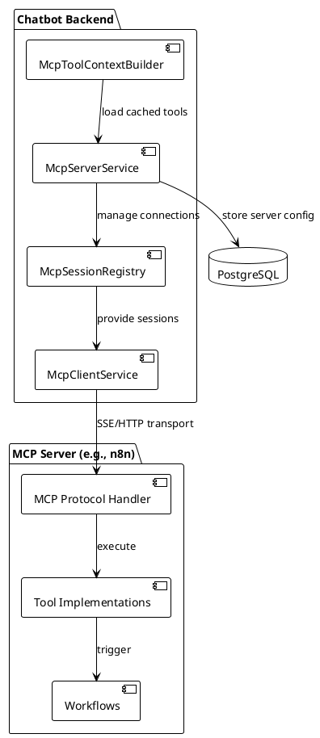
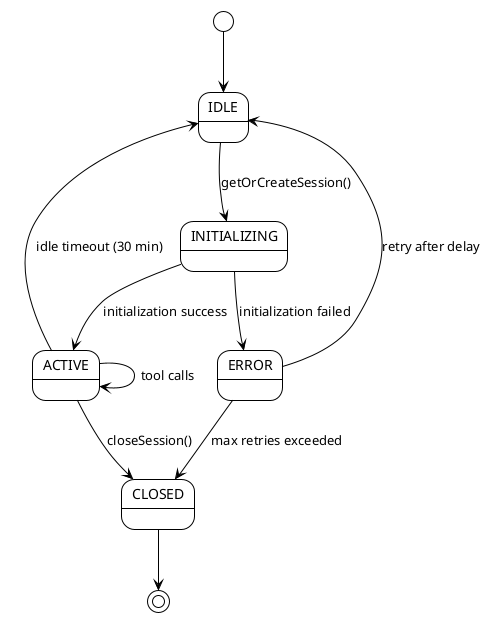
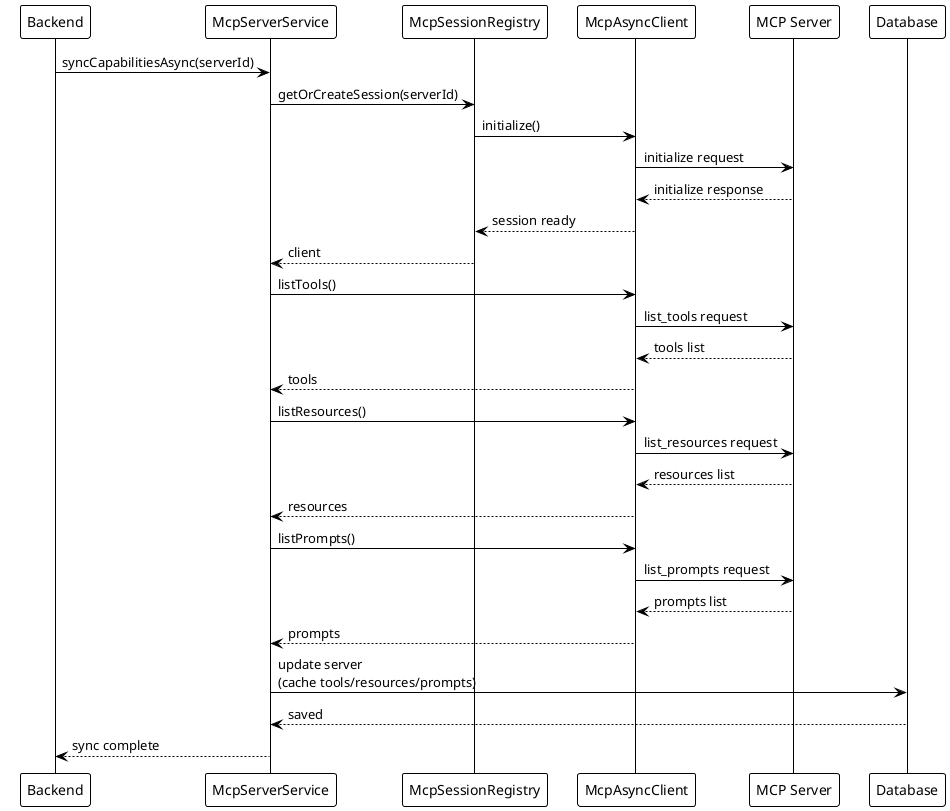
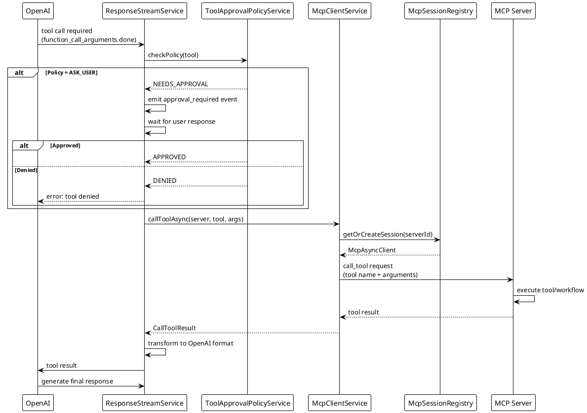
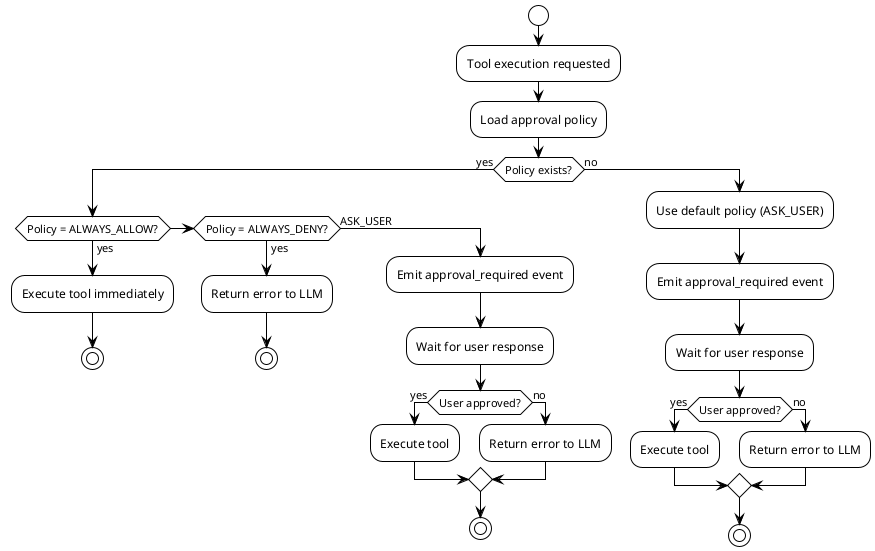

# Model Context Protocol (MCP) Integration

## Overview

The chatbot integrates with the Model Context Protocol (MCP) to dynamically discover and execute tools from external servers. This enables extensibility through external workflows, APIs, and automation platforms like n8n.

## MCP Architecture



## Key Components

### McpSessionRegistry

**Purpose**: Manages lifecycle of MCP client connections

**Responsibilities**:
- Lazy initialization of MCP clients
- Session caching and reuse
- State tracking (INITIALIZING → ACTIVE → ERROR/CLOSED)
- Idle timeout management
- Graceful shutdown

**Implementation**:
```java
@Component
public class McpSessionRegistry implements ApplicationListener<ContextClosedEvent> {
    
    private final ConcurrentHashMap<String, SessionHolder> sessions;
    
    // Get or create MCP client for server
    public Mono<McpAsyncClient> getOrCreateSession(String serverId) {
        return Mono.defer(() -> {
            SessionHolder holder = sessions.computeIfAbsent(
                serverId, 
                key -> createNewSession(serverId)
            );
            return holder.getClient();
        });
    }
    
    // Close specific session
    public Mono<Void> closeSession(String serverId) {
        SessionHolder holder = sessions.remove(serverId);
        if (holder != null) {
            return holder.getClient()
                .flatMap(McpAsyncClient::closeGracefully);
        }
        return Mono.empty();
    }
    
    // Graceful shutdown on app stop
    @Override
    public void onApplicationEvent(ContextClosedEvent event) {
        closeAllSessions().block(Duration.ofSeconds(30));
    }
}
```

### McpServerService

**Purpose**: CRUD operations and connection management for MCP servers

**Responsibilities**:
- Store MCP server configurations
- Verify connections
- Sync and cache capabilities (tools, resources, prompts)
- Track server status

**Key Methods**:
```java
// Verify MCP server connection
public Mono<McpConnectionStatusDto> verifyConnectionAsync(String serverId)

// Sync tools/resources/prompts from MCP server
public Mono<McpServer> syncCapabilitiesAsync(String serverId)

// Update server status
public Mono<Void> updateServerStatusAsync(String serverId, McpServerStatus status)
```

### McpClientService

**Purpose**: Execute MCP operations (list tools, call tools, etc.)

**Responsibilities**:
- List available tools from MCP server
- List resources and prompts
- Execute tool calls
- Handle tool results

**Key Methods**:
```java
// List tools from server
public Mono<List<McpSchema.Tool>> listToolsAsync(McpServer server)

// Call specific tool
public Mono<CallToolResult> callToolAsync(
    McpServer server, 
    String toolName, 
    Map<String, Object> arguments
)

// List resources
public Mono<List<McpSchema.Resource>> listResourcesAsync(McpServer server)

// List prompts
public Mono<List<McpSchema.Prompt>> listPromptsAsync(McpServer server)
```

### McpToolContextBuilder

**Purpose**: Inject MCP tools into OpenAI requests

**Responsibilities**:
- Load tools from database cache
- Transform MCP tool schemas to OpenAI format
- Filter by server status and cache validity

**Implementation**:
```java
@Component
public class McpToolContextBuilder {
    
    public void augmentPayload(ObjectNode payload) {
        // Load connected servers with cached tools
        List<McpServer> connectedServers = serverRepository.findAll()
            .stream()
            .filter(s -> s.getStatus() == McpServerStatus.CONNECTED)
            .filter(s -> s.getToolsCache() != null)
            .filter(this::isCacheValid)
            .toList();
        
        ArrayNode toolsArray = payload.putArray("tools");
        
        for (McpServer server : connectedServers) {
            List<McpSchema.Tool> tools = parseToolsCache(server);
            for (McpSchema.Tool tool : tools) {
                toolsArray.add(transformToOpenAiFormat(tool));
            }
        }
    }
}
```

## MCP Session Lifecycle



## Tool Discovery and Caching

### Discovery Flow



### Cache Structure

**Database Schema**:
```sql
CREATE TABLE mcp_servers (
  id BIGSERIAL PRIMARY KEY,
  server_id VARCHAR(64) UNIQUE NOT NULL,
  name VARCHAR(255) NOT NULL,
  base_url VARCHAR(512) NOT NULL,
  api_key VARCHAR(1024),
  transport VARCHAR(20) NOT NULL,
  status VARCHAR(20) NOT NULL,
  version BIGINT DEFAULT 0,
  tools_cache TEXT,
  resources_cache TEXT,
  prompts_cache TEXT,
  last_synced_at TIMESTAMP,
  sync_status VARCHAR(20) DEFAULT 'NEVER_SYNCED',
  last_updated TIMESTAMP NOT NULL
);
```

**Tools Cache Format** (JSON):
```json
[
  {
    "name": "get_weather",
    "description": "Fetches weather data for a location",
    "inputSchema": {
      "type": "object",
      "properties": {
        "location": {
          "type": "string",
          "description": "City name"
        }
      },
      "required": ["location"]
    }
  }
]
```

### Cache Refresh Strategy

1. **Manual**: Via UI or API endpoint `/api/mcp/servers/{serverId}/sync`
2. **Scheduled**: Background job every 5 minutes
3. **On-Demand**: When cache is stale (TTL exceeded)

**Cache TTL**: 5 minutes (configurable)

## Tool Execution Flow



## Tool Approval System

### Approval Policies

**Policy Types**:
- `ALWAYS_ALLOW`: Tool executes immediately
- `ALWAYS_DENY`: Tool execution blocked
- `ASK_USER`: User must approve (default)

**Database Schema**:
```sql
CREATE TABLE tool_approval_policies (
  id BIGSERIAL PRIMARY KEY,
  server_id BIGINT NOT NULL,
  tool_name VARCHAR(255) NOT NULL,
  policy VARCHAR(20) NOT NULL,
  FOREIGN KEY (server_id) REFERENCES mcp_servers(id),
  UNIQUE(server_id, tool_name)
);
```

### Approval Flow



## MCP Transports

### SSE (Server-Sent Events)

**Use Case**: n8n and other SSE-compatible servers

**Configuration**:
```java
McpTransport transport = new SseServerMcpTransport(
    new URL(server.getBaseUrl())
);

McpAsyncClient client = McpClient.async(transport)
    .clientInfo(new Implementation(
        "chatbot-backend",
        "1.0.0"
    ))
    .requestTimeout(Duration.ofSeconds(14))
    .initializationTimeout(Duration.ofSeconds(2))
    .build();
```

### Streamable HTTP

**Use Case**: HTTP-based MCP servers

**Configuration**:
```java
McpTransport transport = new StreamableHttpClientTransport(
    HttpClient.newHttpClient(),
    new URL(server.getBaseUrl())
);

McpAsyncClient client = McpClient.async(transport)
    .clientInfo(new Implementation(
        "chatbot-backend",
        "1.0.0"
    ))
    .build();
```

## Error Handling

### Connection Errors

**Scenarios**:
- Server unreachable
- Authentication failed
- Timeout

**Handling**:
```java
public Mono<McpAsyncClient> getOrCreateSession(String serverId) {
    return Mono.defer(() -> createClient(serverId))
        .timeout(Duration.ofSeconds(10))
        .retryWhen(Retry.backoff(3, Duration.ofMillis(100)))
        .onErrorResume(ex -> {
            log.error("Failed to create MCP session for {}", serverId, ex);
            return updateServerStatus(serverId, McpServerStatus.ERROR)
                .then(Mono.error(ex));
        });
}
```

### Tool Execution Errors

**Scenarios**:
- Tool not found
- Invalid arguments
- Execution timeout
- Tool failed

**Handling**:
```java
public Mono<CallToolResult> callToolAsync(
    McpServer server,
    String toolName,
    Map<String, Object> arguments
) {
    return sessionRegistry.getOrCreateSession(server.getServerId())
        .flatMap(client -> {
            CallToolRequest request = new CallToolRequest(toolName, arguments);
            return client.callTool(request);
        })
        .timeout(Duration.ofSeconds(30))
        .onErrorResume(ex -> {
            log.error("Tool execution failed: {}", toolName, ex);
            return Mono.just(CallToolResult.error(ex.getMessage()));
        });
}
```

## Configuration

### Backend Configuration

```properties
# MCP Configuration
mcp.session.idle-timeout=30m
mcp.session.initialization-timeout=10s
mcp.capabilities.cache-ttl=5m
mcp.approval.default-policy=ASK_USER
mcp.approval.timeout=60s

# Encryption
mcp.encryption.key=${MCP_ENCRYPTION_KEY}
mcp.encryption.algorithm=AES/GCM/NoPadding
```

### n8n MCP Server Setup

**Prerequisites**:
- n8n running (via Docker Compose)
- MCP server enabled in n8n

**Configuration**:
```yaml
# docker-compose.yml
services:
  n8n:
    image: n8nio/n8n:latest
    environment:
      - N8N_MCP_ENABLED=true
      - N8N_MCP_SERVER_ID=n8n-server-1
    ports:
      - "5678:5678"
```

**Add to Chatbot**:
1. Frontend → Settings → MCP Servers → Add Server
2. Name: "n8n Workflows"
3. Base URL: `http://n8n:5678/api/mcp/sse`
4. Transport: SSE
5. API Key: (n8n API key)
6. Click Save → Verify

## Monitoring and Metrics

### Key Metrics

- **Session Lifecycle**: Created, Active, Closed, Errors
- **Tool Execution**: Latency, Success Rate, Error Rate
- **Cache**: Hit Rate, Miss Rate, Refresh Frequency
- **Approval**: Request Frequency, Approval Rate, Timeout Rate

### Health Checks

```java
@Component
public class McpHealthIndicator implements HealthIndicator {
    
    @Override
    public Health health() {
        List<McpServer> servers = serverRepository.findAll();
        
        long connectedCount = servers.stream()
            .filter(s -> s.getStatus() == McpServerStatus.CONNECTED)
            .count();
        
        long errorCount = servers.stream()
            .filter(s -> s.getStatus() == McpServerStatus.ERROR)
            .count();
        
        if (errorCount == servers.size()) {
            return Health.down()
                .withDetail("servers", servers.size())
                .withDetail("errors", errorCount)
                .build();
        }
        
        return Health.up()
            .withDetail("servers", servers.size())
            .withDetail("connected", connectedCount)
            .withDetail("errors", errorCount)
            .build();
    }
}
```

## Best Practices

### Session Management

1. **Reuse Sessions**: Don't create new clients for every call
2. **Graceful Shutdown**: Always close sessions on app stop
3. **Idle Timeout**: Close unused sessions after 30 minutes
4. **Error Recovery**: Retry with backoff on transient errors

### Tool Execution

1. **Timeout**: Set appropriate timeouts (30s default)
2. **Fallback**: Support multiple servers for same tool
3. **Validation**: Validate arguments before execution
4. **Logging**: Log all tool executions for debugging

### Caching

1. **TTL**: Use reasonable cache TTL (5 minutes)
2. **Sync**: Refresh cache periodically (background job)
3. **Validation**: Check cache validity before use
4. **Error Handling**: Gracefully handle cache parse errors

### Security

1. **API Keys**: Always encrypt API keys in database
2. **Approval**: Use ASK_USER for untrusted tools
3. **Validation**: Sanitize tool arguments
4. **Logging**: Log all tool approvals and denials

## Troubleshooting

### Session Creation Fails

**Symptoms**: Error creating MCP session, timeout

**Diagnosis**:
1. Check server URL is correct
2. Verify server is running: `curl <base-url>`
3. Check firewall rules
4. View logs: `docker logs chatbot-backend`

**Solution**:
- Update server URL
- Restart MCP server
- Check network connectivity

### Tool Not Available

**Symptoms**: Tool not shown in chat, not injected into OpenAI request

**Diagnosis**:
1. Check server status: `GET /api/mcp/servers`
2. Check tools cache: `GET /api/mcp/servers/{id}/capabilities`
3. View logs for sync errors

**Solution**:
- Sync capabilities: `POST /api/mcp/servers/{id}/sync`
- Verify tool exists on MCP server
- Check cache TTL hasn't expired

### Tool Execution Fails

**Symptoms**: Tool execution error, timeout

**Diagnosis**:
1. Check tool arguments are valid
2. View backend logs for error details
3. Test tool directly on MCP server

**Solution**:
- Fix argument format
- Increase timeout if needed
- Check MCP server logs
- Verify tool implementation

See also:
- [System Overview](./SYSTEM_OVERVIEW.md)
- [OpenAI Responses API](./OPENAI_RESPONSES_API.md)
- [Frontend-Backend Communication](./FRONTEND_BACKEND_COMMUNICATION.md)
