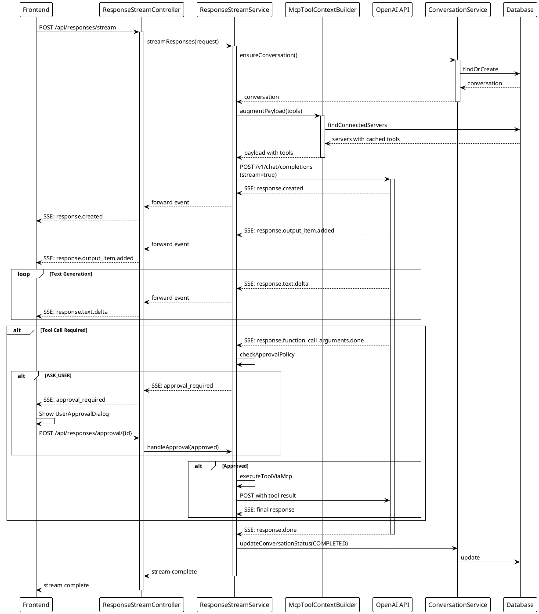
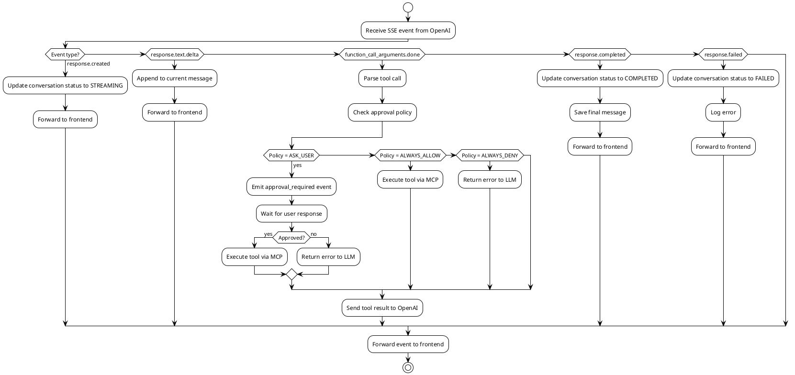

# OpenAI Responses API Integration

## Overview

The chatbot uses the OpenAI Responses API v1 for streaming chat completions. This document describes the integration architecture, streaming events, and data flow.

## Streaming Architecture



## Streaming Events

### General Flow Events

#### response.created
- **Purpose**: Signals start of new response
- **When**: First event after stream opens
- **Contains**: Response ID, initial status

```json
{
  "type": "response.created",
  "response": {
    "id": "resp_abcdef123",
    "status": "in_progress"
  },
  "event_id": "event_XYZ789"
}
```

#### response.output_item.added
- **Purpose**: Announces new output section
- **When**: Before content starts streaming
- **Contains**: Item ID, output index

```json
{
  "type": "response.output_item.added",
  "item_id": "msg_1",
  "output_index": 0
}
```

#### response.text.delta
- **Purpose**: Streams text content incrementally
- **When**: During text generation (multiple times)
- **Contains**: Text fragment (delta)

```json
{
  "type": "response.text.delta",
  "delta": "Hello, ",
  "item_id": "msg_1",
  "content_index": 0,
  "output_index": 0
}
```

#### response.text.done
- **Purpose**: Marks end of text output
- **When**: After last text.delta
- **Contains**: Item ID reference

```json
{
  "type": "response.text.done",
  "item_id": "msg_1",
  "content_index": 0
}
```

#### response.output_item.done
- **Purpose**: Completes an output item
- **When**: After all content for item is sent
- **Contains**: Full item with consolidated content

```json
{
  "type": "response.output_item.done",
  "item": {
    "id": "msg_1",
    "object": "message_output",
    "content": "Hello World!"
  }
}
```

#### response.completed
- **Purpose**: Response successfully completed
- **When**: End of successful stream
- **Contains**: Final response status

```json
{
  "type": "response.completed",
  "response": {
    "id": "resp_abcdef123",
    "status": "completed"
  }
}
```

#### response.incomplete
- **Purpose**: Response truncated (e.g., token limit)
- **When**: Instead of completed when limit reached
- **Contains**: Response with incomplete status

```json
{
  "type": "response.incomplete",
  "response": {
    "id": "resp_abcdef123",
    "status": "incomplete"
  }
}
```

### Tool Call Events

#### response.function_call_arguments.delta
- **Purpose**: Streams function call arguments
- **When**: LLM generates tool call
- **Contains**: JSON fragment of arguments

```json
{
  "type": "response.function_call_arguments.delta",
  "delta": "{\"city\": \"Berlin",
  "item_id": "tool_call_1",
  "output_index": 0
}
```

#### response.function_call_arguments.done
- **Purpose**: Function call arguments complete
- **When**: All arguments received
- **Triggers**: Tool execution flow

```json
{
  "type": "response.function_call_arguments.done",
  "item_id": "tool_call_1",
  "output_index": 0
}
```

### MCP Tool Events

#### response.mcp_call.in_progress
- **Purpose**: MCP tool call initiated
- **When**: Tool execution starts
- **Contains**: Tool call reference

```json
{
  "type": "response.mcp_call.in_progress",
  "item_id": "ext_tool_1",
  "output_index": 0
}
```

#### response.mcp_call.arguments.delta
- **Purpose**: Streams MCP tool arguments
- **When**: Building arguments for external tool
- **Contains**: Argument fragments

```json
{
  "type": "response.mcp_call.arguments.delta",
  "delta": "{\"query\": \"Weather in Berlin",
  "item_id": "ext_tool_1",
  "output_index": 0
}
```

#### response.mcp_call.completed
- **Purpose**: MCP tool execution complete
- **When**: External tool returns result
- **Contains**: Tool call reference

```json
{
  "type": "response.mcp_call.completed",
  "item_id": "ext_tool_1",
  "output_index": 0
}
```

### Error Events

#### response.failed
- **Purpose**: Response generation failed
- **When**: Unrecoverable error during streaming
- **Contains**: Error details

```json
{
  "type": "response.failed",
  "response": {
    "id": "resp_abcdef123",
    "status": "failed",
    "error": {
      "code": "server_error",
      "message": "Internal server error"
    }
  }
}
```

#### response.error
- **Purpose**: Error during generation
- **When**: Specific error condition (rate limit, etc.)
- **Contains**: Error code and message

```json
{
  "type": "response.error",
  "error": {
    "code": "rate_limit_exceeded",
    "message": "Rate limit exceeded"
  }
}
```

## Backend Implementation

### ResponseStreamService

**Key Responsibilities**:
1. Stream management and orchestration
2. Tool execution with approval checks
3. Error handling and recovery
4. Conversation status updates

**Main Methods**:

```java
// Main streaming endpoint
public Flux<ServerSentEvent<String>> streamResponses(
    ResponseStreamRequest request,
    String authorizationHeader
)

// Tool execution with approval
private Mono<JsonNode> executeToolWithApproval(
    String serverId,
    String toolName,
    Map<String, Object> arguments
)

// Parse SSE events
private void handleServerSentEvent(String event, String data)
```

### Event Processing Flow



## Frontend Implementation

### SSE Client

**Library**: `@microsoft/fetch-event-source`

**Usage**:
```typescript
fetchEventSource("/api/responses/stream", {
  method: "POST",
  headers: { "Content-Type": "application/json" },
  body: JSON.stringify(payload),
  onmessage: (event) => {
    const data = JSON.parse(event.data);
    handleStreamEvent(data);
  },
  onerror: (err) => {
    handleStreamError(err);
  }
});
```

### Event Handling

**State Updates**:
```typescript
const handleStreamEvent = (data: StreamEvent) => {
  switch (data.type) {
    case 'response.text.delta':
      // Append delta to current message
      appendToCurrentMessage(data.delta);
      break;
      
    case 'approval_required':
      // Show approval dialog
      showApprovalDialog(data.toolCall);
      break;
      
    case 'response.completed':
      // Mark stream as complete
      setStreamingComplete();
      break;
      
    case 'response.failed':
      // Handle error
      handleError(data.error);
      break;
  }
};
```

## Tool Approval Flow

```plantuml
@startuml
!theme plain

actor User
participant Frontend
participant Backend
participant "Approval Service" as Approval
participant "MCP Client" as MCP
participant "Tool Server" as Tool

Backend -> Approval: checkPolicy(tool)
activate Approval

alt Policy = ASK_USER
  Approval --> Backend: NEEDS_APPROVAL
  Backend --> Frontend: approval_required event
  
  Frontend -> User: Show approval dialog
  User -> Frontend: Approve/Deny
  Frontend -> Backend: POST /approval/{id}
  
  Backend -> Approval: recordDecision
  
  alt Approved
    Approval --> Backend: APPROVED
    Backend -> MCP: executeTool
    activate MCP
    MCP -> Tool: call tool
    Tool --> MCP: result
    MCP --> Backend: result
    deactivate MCP
  else Denied
    Approval --> Backend: DENIED
    Backend --> Frontend: tool_denied event
  end
  
elseif Policy = ALWAYS_ALLOW
  Approval --> Backend: APPROVED
  Backend -> MCP: executeTool
  MCP -> Tool: call tool
  Tool --> MCP: result
  MCP --> Backend: result
  
elseif Policy = ALWAYS_DENY
  Approval --> Backend: DENIED
  Backend --> Frontend: tool_denied event
end

deactivate Approval

@enduml
```

## Configuration

### Backend Configuration

```properties
# OpenAI API Configuration
openai.base-url=http://localhost:4000
openai.api-key=${OPENAI_API_KEY}

# Streaming Configuration
openai.stream.timeout=30s
openai.stream.buffer-size=8192

# Tool Approval
mcp.approval.default-policy=ASK_USER
mcp.approval.timeout=60s
```

### Frontend Configuration

```typescript
// SSE Configuration
const SSE_CONFIG = {
  timeout: 30000,
  retryDelay: 1000,
  maxRetries: 3
};

// Stream handling
const STREAM_CONFIG = {
  deltaBufferSize: 100,
  flushInterval: 50
};
```

## Error Handling

### Backend Error Handling

1. **Connection Errors**: Retry with exponential backoff
2. **Timeout Errors**: Mark conversation as INCOMPLETE
3. **Tool Execution Errors**: Send error to LLM, continue conversation
4. **Stream Interruption**: Graceful cleanup, save partial message

### Frontend Error Handling

1. **SSE Connection Lost**: Show reconnect button
2. **Tool Approval Timeout**: Show timeout message
3. **Stream Error**: Display error, allow retry
4. **Network Error**: Queue message, retry when online

## Performance Considerations

### Backend Optimization

- Connection pooling for OpenAI API
- Reactive streams (no thread blocking)
- Tool cache to reduce MCP calls
- Session reuse for MCP connections

### Frontend Optimization

- Debounced UI updates (50ms)
- Virtual scrolling for long conversations
- Message chunking for large responses
- Lazy loading of conversation history

## Monitoring and Metrics

### Key Metrics

- Stream duration (P50, P95, P99)
- Tool execution latency
- Approval request frequency
- Error rate by type
- Token usage per conversation

### Health Checks

- OpenAI API connectivity
- MCP server availability
- Database connection pool
- SSE connection count

See also:
- [System Overview](./SYSTEM_OVERVIEW.md)
- [MCP Integration](./MCP_INTEGRATION.md)
- [Frontend-Backend Communication](./FRONTEND_BACKEND_COMMUNICATION.md)
