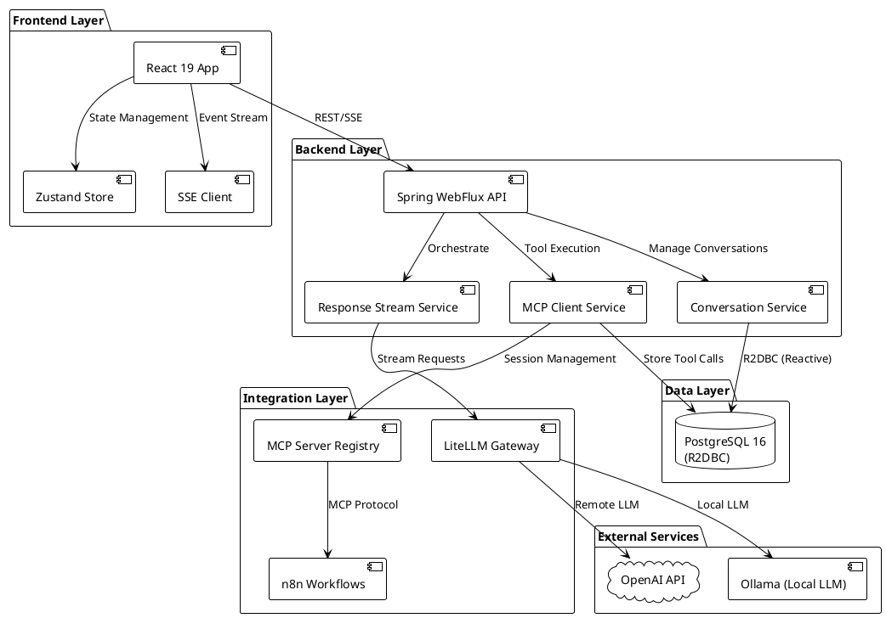
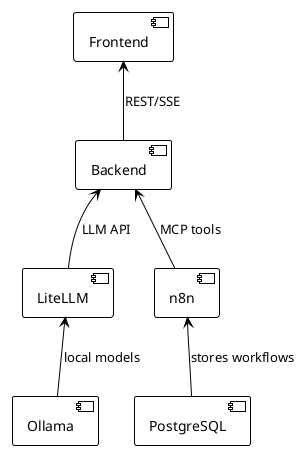
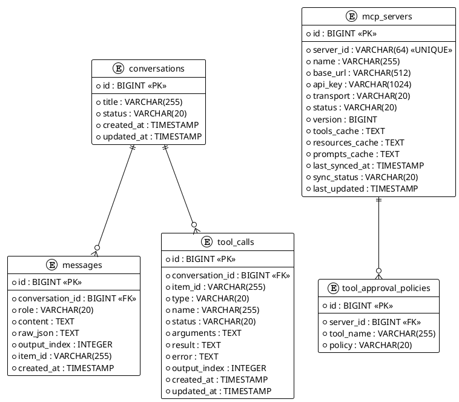
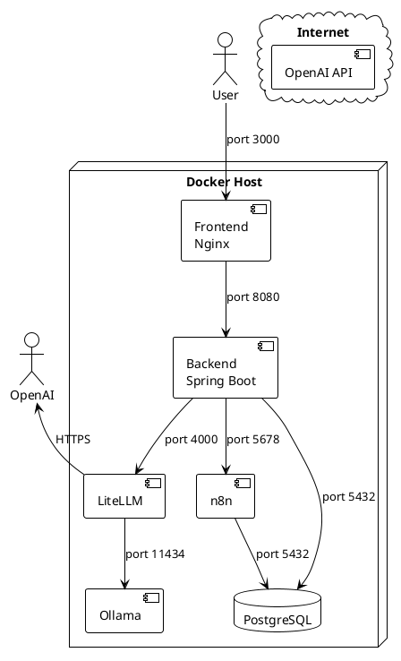

# System Architecture Overview

## High-Level Architecture

This is a full-stack reactive chatbot application built with modern technologies.

### Component Diagram

## Technology Stack

### Backend
- **Framework**: Spring Boot 3.4.0 with WebFlux (reactive, non-blocking)
- **Language**: Java 17
- **Database**: PostgreSQL 16 with R2DBC (reactive driver)
- **Build Tool**: Gradle 8.x
- **Security**: AES-GCM encryption for API keys

### Frontend
- **Framework**: React 19.1
- **Build Tool**: Vite 7.1
- **Language**: TypeScript 5.9
- **State Management**: Zustand 5.0
- **HTTP Client**: Fetch API + SSE via `@microsoft/fetch-event-source`

### Infrastructure
- **Containerization**: Docker + Docker Compose
- **LLM Gateway**: LiteLLM (supports OpenAI, Ollama, etc.)
- **Automation**: n8n workflow engine
- **Model Runtime**: Ollama (local LLM execution)

## Key Features

1. **Streaming Chat**: Server-Sent Events (SSE) for real-time message streaming
2. **MCP Integration**: Dynamic tool discovery and execution from external MCP servers
3. **Tool Approval System**: User can approve/deny tool executions with configurable policies
4. **n8n Workflows**: Execute automated workflows triggered from chat
5. **Reactive Architecture**: Fully non-blocking I/O for scalability

## Service Dependencies

## Ports and Endpoints

| Service | Port | URL |
|---------|------|-----|
| Frontend | 3000 | http://localhost:3000 |
| Backend | 8080 | http://localhost:8080 |
| Backend Health | 8080 | http://localhost:8080/actuator/health |
| n8n | 5678 | http://localhost:5678 |
| LiteLLM | 4000 | http://localhost:4000 |
| Ollama | 11434 | http://localhost:11434 |
| PostgreSQL | 5432 | localhost:5432 |

## Data Flow Overview

### Request Flow
1. User types message in React frontend
2. Frontend sends POST request to Backend SSE endpoint
3. Backend streams request to LiteLLM/OpenAI
4. If tool call needed, Backend executes via MCP
5. Results streamed back to Frontend via SSE
6. Frontend updates UI in real-time

### Tool Execution Flow
1. LLM requests tool execution
2. Backend checks approval policy
3. If approved, Backend calls MCP server
4. MCP server (e.g., n8n) executes workflow
5. Result returned to Backend
6. Backend sends result to LLM
7. LLM generates final response
8. Response streamed to Frontend

## Database Schema

### Core Tables

> **Note:** Since delegating MCP management to LiteLLM, the `mcp_servers` and `tool_approval_policies` tables were removed (see migration `V8__drop_mcp_tables.sql`). The ERD above is preserved for historical context only.

## Security Architecture

### LiteLLM Admin Token
- Backend no longer stores MCP credentials. Instead it calls LiteLLM's admin API with `LITELLM_ADMIN_TOKEN`.
- Keep this token in a secrets manager or CI/CD vault; rotate it periodically.

### Tool Approval Flow
- OpenAI's Responses API emits `mcp_approval_request` events when human approval is needed.
- The frontend surfaces these events through the existing approval dialog; no per-tool policy storage is required anymore.

### Authentication
- Backend validates OpenAI API key
- MCP servers authenticated via API key
- n8n authenticated via API key

## Scalability Considerations

### Reactive Architecture
- Non-blocking I/O throughout the stack
- Backpressure handling with Project Reactor
- Connection pooling for database (R2DBC)

### Caching
- MCP capabilities cached in database
- Tool/resource/prompt discovery cached
- Session reuse for MCP connections

### Resource Management
- MCP session lifecycle managed by registry
- Idle timeout for unused sessions (30 min)
- Graceful shutdown of all sessions

## Monitoring and Observability

### Health Checks
- Spring Boot Actuator endpoints
- Database connection health
- MCP server connection status

### Logging
- Structured logging with SLF4J
- Debug level for MCP operations
- Error tracking for tool executions

## Deployment Architecture

See also:
- [OpenAI Responses API Flow](./OPENAI_RESPONSES_API.md)
- [MCP Integration](./MCP_INTEGRATION.md)
- [Frontend-Backend Communication](./FRONTEND_BACKEND_COMMUNICATION.md)
